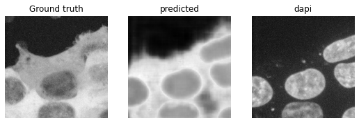
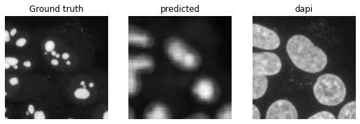
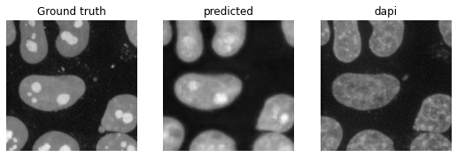
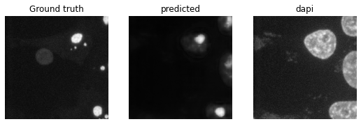
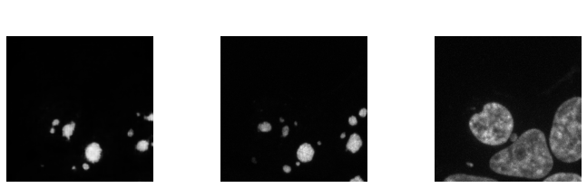
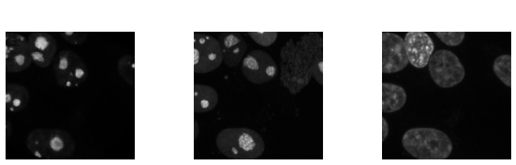

# Protein localization prediction/generation from nucleus images

Predict/generate protein locations in cells using nucleus images. Data from [Opencell](https://opencell.czbiohub.org/). Each data image consists of two channels, one for DAPI (nuclues staining) and one for the protein location.

Prediction is performed using a [U-net](https://arxiv.org/abs/1505.04597). U-net architecture adapted from [here](https://github.com/jvanvugt/pytorch-unet/blob/master/unet.py). The model is trained with DAPI and a numeric protein ID as input, and fitted agains the true protein localization image with squared loss.

Generative modelling is done with a conditional GAN, using the [Pix2Pix](https://arxiv.org/abs/1611.07004) model, adapted from [here](https://github.com/junyanz/pytorch-CycleGAN-and-pix2pix). The DAPI image and protein ID are fed as conditional inputs to the generator, which is trained agains a discriminator on real and fake protein localization images.

## Preprocessing
The data (see "Raw Microscopy Images" section [here](https://opencell.czbiohub.org/download)) is stored in a S3 bucket. When downloaded, the data for each protein will come in a separate directory, with names of the form "ATL3\_ENSG00000184743", where "ATL3" is the protein name.

To train models, the following summary files of the data have to be created: 
1. ``, a csv file that lists all the filenames used for training.
2. `<protein file>`, a dictionary that maps each protein to a unique ID, in pickle format.
3. `<theta file>`, a Pytorch .pth file that contains a matrix, where each row is a vector embedding for each protein. This is a kind of vector valued ID for each protein, which is hopefully more informative to the model than a numerical label. This is only needed for the generative model. To start one could use random Gaussian vectors as embeddings. Or one could train a regression U-net, then extract the lower hidden layers of the U-net as the embeddings for a generative model.

## Training
To train the U-net for regression, use
`python train.py --num_threads --protein_list <protein file> --img_dir <imgs> --img_list `

To train the Pix2Pix model for generation, use
`python train.py --is_gan --num_threads --pix2pix_gen --protein_list <protein file> --img_dir <train imgs> --img_list  --theta_file <theta file>`

`<protein file>` is a pickle file that stores a dictionary which maps each protein to a unique ID. `<imgs>` is the directory of the tiff images. `` is the list of images to be used for training. `<theta file>` isthe file containing theta, as described in the previous section. 

## Results
The proteins are quite diverse, and each protein only have around 5 images, so when trained on all the proteins together the regression model does not seem to do so well:

Here the left column the the ground truth of the protein location from a test set image; the middle column is the generated location image; the right is the nucleus staining image that is given as model input.

When we train the regression model on only protein that appear within the nucleus, the results are much better:

The generative model seems to produce much sharper images, although it also "hallucinates" some signal:

This is probably because the GANs are not trained on a pixel-wise loss, but instead on a combination of pixel-wise and discriminator losses, which encourages realistic reconstructions.
